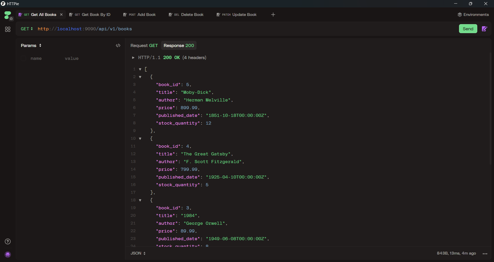
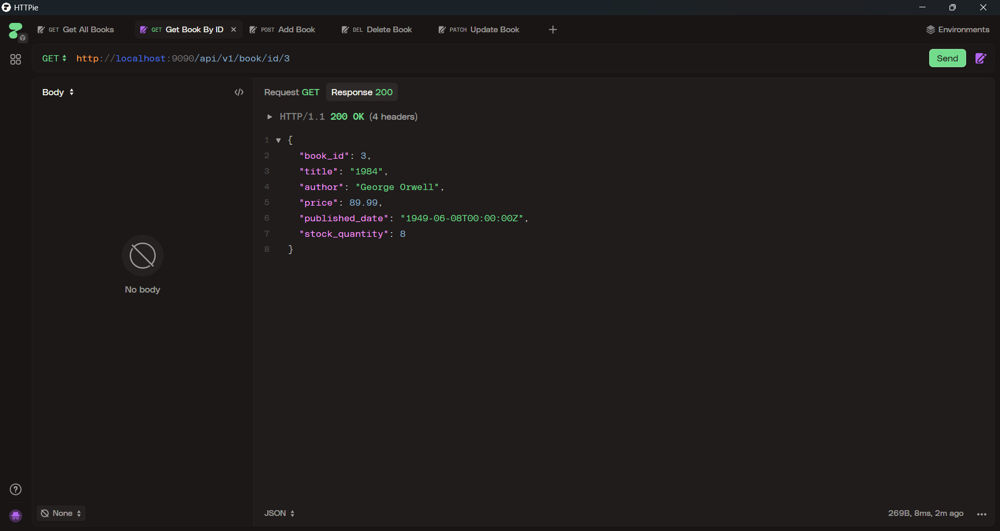
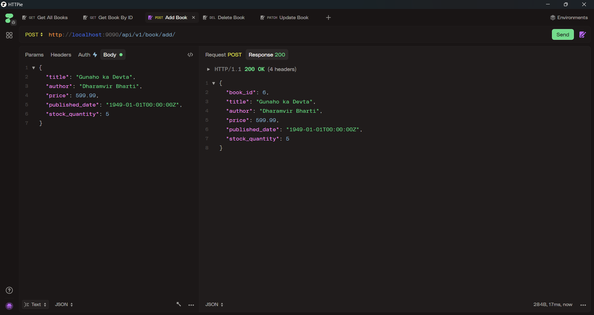
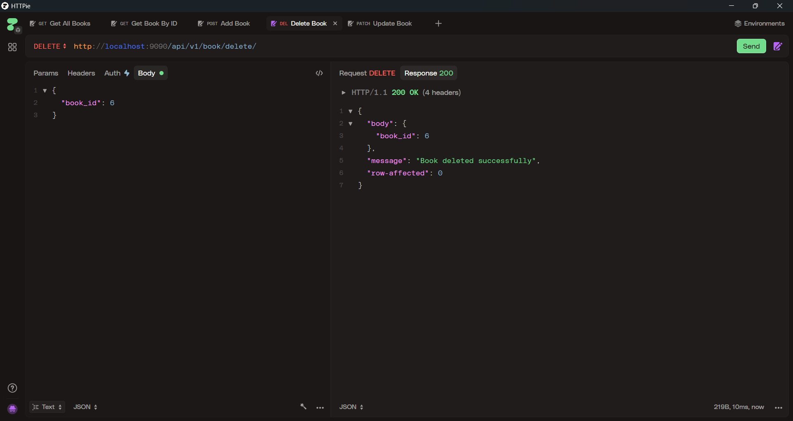
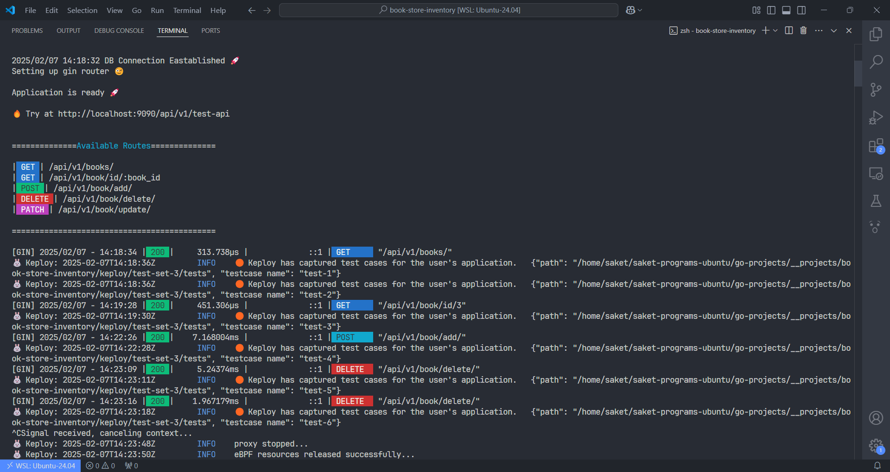
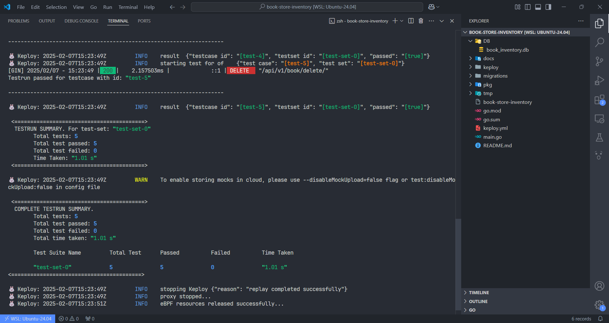
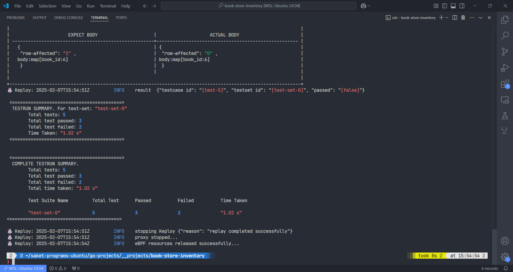

<div align="center">
  <!--  -->
</div>

<h1 align="center">Book Store Inventory</h1>

<div align="center">

<br>

</div>
<br>

A simple book store inventory backend built using the Gin framework and SQLite as the database.

## :computer: Tech Stack
- [**Go**](https://go.dev/) : Programming language
- [**Gin**](https://github.com/gin-gonic/gin) : Web framework
- [**SQLite3**](https://github.com/mattn/go-sqlite3) : A sqlite3 database driver

<br>

## :book: How to Use / Run on Your Machine

- ### Prerequisites:
    - Install Go (version >= 1.23.3): https://golang.org/dl/
    - API Testing Tool
      - [Postman](https://www.postman.com/downloads/)
      - [Httpie](https://httpie.io/download)

> I am using [**HttPie**](https://httpie.io/download) for API testing
> you can use any tool as per your requirement
> and `curl` is fine too :D

> [!IMPORTANT]  
> I am using WSL (Ubuntu). I recommend using Linux/WSL or macOS.

<br>

### :package: Keploy Installation
for detailed installation info visit
https://keploy.io/docs/server/installation/#keploy-installation

```sh
 curl --silent -O -L https://keploy.io/install.sh && source install.sh
```

<br>

### :toolbox: Setup Project Locally:

- Clone the repository:
```sh
git clone https://github.com/keploy/samples-go.git
```

- Navigate to the project directory:
```sh
cd book-store-inventory
```

- Install dependencies:
```sh
go mod download
```
- Generate Database with some default data:

> [!IMPORTANT]
>
> `OPTIONAL STEP` as I have already included the `book_inventory.db`
>
>  delete the `book_inventory.db` in `DB/book_inventory.db` and use below command to generate new one

```sh
go run migrations/migration.go
```

- Building the Application Binary:
```sh
go build
```

> :rocket: You're all set! Now you have `book-store-inventory`


<br>

### :inbox_tray: Capture the test cases using Keploy

```sh
sudo -E keploy record -c "./book-store-inventory"
```
> [!TIP]
> If any error occur try above command without `sudo -E`


<br>

### :satellite: Open the Postman/Httpie and Make Request

<div align="center">
    
    
</div>

<div align="center">
    
    
</div>

<br>

### :bookmark_tabs: Available REST API End Points

| Method  | Endpoint                                              | Description                     |
|---------|-------------------------------------------------------|---------------------------------|
| **GET** | `http://localhost:9090/api/v1/books/`                 | Get all books                   |
| **GET** | `http://localhost:9090/api/v1/book/id/:book_id`       | Get a book by ID                |
| **POST** | `http://localhost:9090/api/v1/book/add/`             | Add a new book                  |
| **DELETE** | `http://localhost:9090/api/v1/book/delete/`        | Delete a book                   |
| **PATCH** | `http://localhost:9090/api/v1/book/update/`         | Update a book                   |
| **GET** | `http://localhost:9090/api/test-api`                  | Test API (New Endpoint)         |


<br>

> [!TIP]
>
> for now just call `GET` for `http://localhost:9090/api/v1/books/`
> 
> and record this test

<br>

### :jigsaw: Usage Examples

> [!IMPORTANT]  
> Add these json value as body while making request

- #### POST (Add New Book)

body of the request
```json
{
  "title": "Gunaho ka Devta",
  "author": "Dharamvir Bharti",
  "price": 599.99,
  "published_date": "1949-01-01T00:00:00Z",
  "stock_quantity": 5
}
```

- #### DELETE (Delete Book by ID)

body of the request
```json
{
  "book_id": 6
}
```

- #### PATCH (Update Book by ID)

body of the request
```json
{
  "book_id": 6,
  "title": "Gunaho ka God (latest edition)",
  "author": "Dharamvir Bharti Ji",
  "price": 599.99,
  "published_date": "1949-01-01T00:00:00Z",
  "stock_quantity": 5
}
```

<div align="center">
    
</div>

<br>

### :test_tube: Run the captured test case

> [!IMPORTANT]  
> Stop the test capturing by pressing `ctrl+c` or `ctrl+z`

start the test using keploy
```sh
sudo -E keploy test -c  "./book-store-inventory" --delay 1
```

<div align="center">
    
    
</div>

<br>

## :seedling: Todo / Future Improvements
- [x] Show All Books Data
- [x] Get Particular Book By ID
- [x] Add New Book Data
- [x] Delete Book Data
- [x] Update Book Data
- [ ] UI for this Application (NextJS/Vite-React)


## :compass: About
This project was created as a sample to understand the working of Keploy.