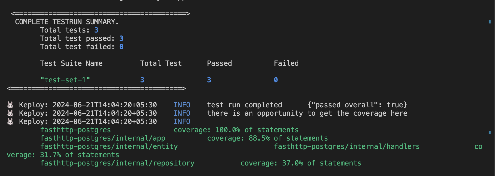
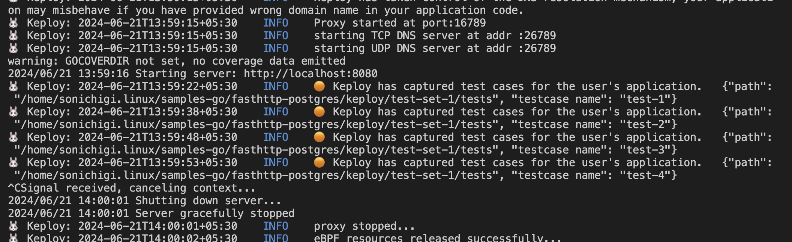

# FastHttp-Postgres

A sample application that get, create, update, and delete the data of a user in the database: - 

## Start Users-Profile sample application
```
git clone https://github.com/keploy/samples-go && cd fasthttp-postgres

```

## Installation

```bash
curl --silent -O -L https://keploy.io/install.sh && source install.sh
```

Keploy can be used on Linux, Windows and MacOS through [Docker](https://docs.docker.com/engine/install/).

> Note: To run Keploy on MacOS through [Docker](https://docs.docker.com/desktop/release-notes/#4252) the version must be ```4.25.2``` or above.

### Option 1: Run with Docker

Start the server:
```bash
docker-compose up --build
```

Capture testcases:
```shell
keploy record -c "docker-compose up" --container-name=fasthttp_app
```

Run Captured Testcases:
```shell
keploy test -c "docker-compose up" --container-name=fasthttp_app --delay 10
```




### Option 2: Run Without Docker

> Note: When running the app locally, ensure `DB_HOST=localhost` is set in the environment.


Start the Postgres container:
```bash
docker-compose up -d postgres
```

Run the application:
```bash
go run main.go
```

Capture testcases:
```shell
keploy record -c "go run main.go"
```

Run Captured Testcases:
```shell
keploy test -c "go run main.go" --goCoverage --delay 10
```


To genereate testcases we just need to make some API calls. You can use [Postman](https://www.postman.com/), [Hoppscotch](https://hoppscotch.io/), or simply `curl`: -

1. Post Requests
```shell
curl -X POST -H "Content-Type: application/json" -d '{"name":"Author Name"}' http://localhost:8080/authors

curl -X POST -H "Content-Type: application/json" -d '{"title":"Book Title","author_id":1}' http://localhost:8080/books
```

2. Get Requests
```bash
curl -i http://localhost:8080/books
```




_Voila! Our testcases have passed🥳_ . We can also notice that by capturing just few API calls we got around 88.5% of aggregated coverage with keploy generated testcases

If you like the sample application, Don't forget to star us ✨
    