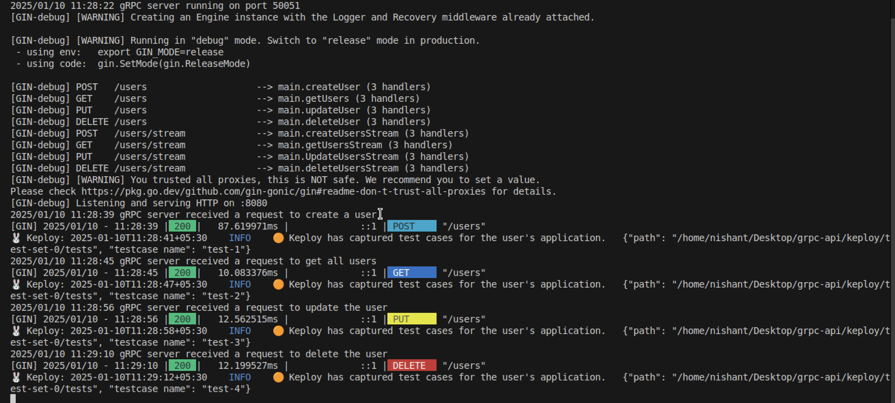
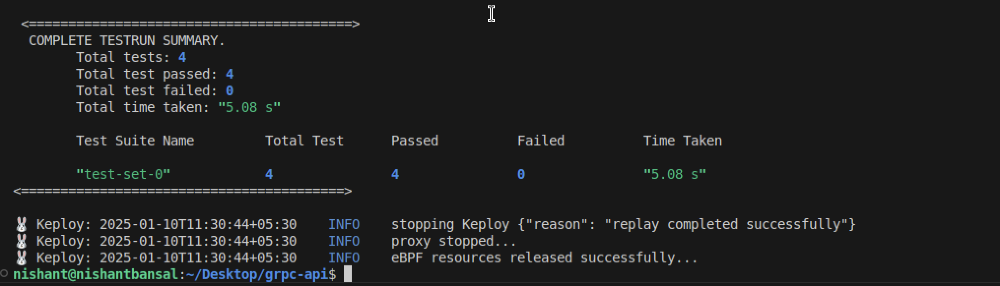
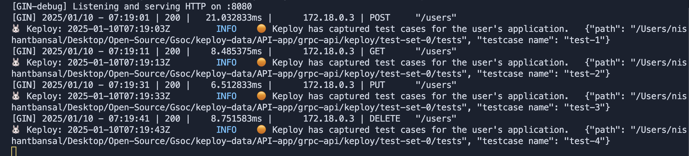
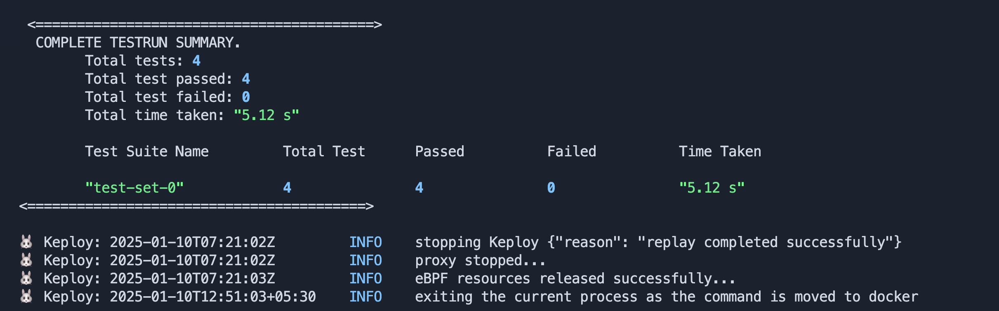

## Introduction

A sample application that features a gRPC server handling CRUD operations with unary and streaming RPCs, and a client web server translating HTTP requests into gRPC calls.

## Setup gRPC App

```bash
git clone https://github.com/keploy/samples-go.git && cd samples-go/go-grpc
go mod download
```

## Installation

Keploy can be used on Linux, Windows and MacOS through [Docker](https://docs.docker.com/engine/install/).

> Note: To run Keploy on MacOS through [Docker](https://docs.docker.com/desktop/release-notes/#4252) the version must be ```4.25.2``` or above.

## Run app Natively on local machine

### Let's create the binary of our application
```bash
go build -o grpc-server .
go build -o grpc-client ./client
```

### Capture the Testcases
Once we have our binary file ready,this command will start the recording of API calls:
```bash
sudo -E keploy record -c "bash -c './grpc-server & ./grpc-client'"
```

To generate testcases we just need to make some API calls. You can use [Postman](https://www.postman.com/), [Hoppscotch](https://hoppscotch.io/), or simply `curl`

### Generate testcases

1. POST request calling unary RPCs
```bash
curl -X POST http://localhost:8080/users \
-H "Content-Type: application/json" \
-d '{
    "name": "test-user",
    "email": "test@gmail.com",
    "age": 20
}'
```

2. GET request calling unary RPCs
```bash
curl -X GET http://localhost:8080/users
```

3. PUT request calling unary RPCs
```bash
curl -X PUT http://localhost:8080/users \
    -H "Content-Type: application/json" \
    -d '{
        "id": 1,
        "name": "test-user-updated",
        "email": "test@gmail.com",
        "age": 20
    }'
```

4. DELETE request calling unary RPCs
```bash
curl -X DELETE http://localhost:8080/users \
    -H "Content-Type: application/json" \
    -d '{
        "id": 1
    }'
```

**NOTE:** Currently, streaming RPC support is not integrated with Keploy's gRPC parser. Therefore, the following API calls may not work as expected with Keploy:
1. POST request calling streaming RPCs
```bash
curl -X POST http://localhost:8080/users/stream \
    -H "Content-Type: application/json" \
    -d '[
        {
            "name": "test1",
            "email": "test1@gmail.com",
            "age": 20
        },
        {
            "name": "test2",
            "email": "test2@gmail.com",
            "age": 20
        },
        {
            "name": "test3",
            "email": "test3@gmail.com",
            "age": 20
        }
    ]'
```

2. GET request calling streaming RPCs
```bash
curl -X GET http://localhost:8080/users/stream
```

3. PUT request calling streaming RPCs
```bash
curl -X PUT http://localhost:8080/users/stream \
-H "Content-Type: application/json" \
-d '[
    {
        "id": 2,
        "name": "test1-updated",
        "email": "test1@gmail.com",
        "age": 20
    },
    {
        "id": 4,
        "name": "test3-updated",
        "email": "test3@gmail.com",
        "age": 20
    }
]'
```
4. DELETE request calling streaming RPCs
```bash
curl -X DELETE http://localhost:8080/users/stream \
-H "Content-Type: application/json" \
-d '[
    {
        "id": 2
    },
    {
        "id": 3
    }
]'
```

Now all these API calls were captured as a testcase and should be visible on the Keploy CLI. You should be seeing an app named `keploy` folder with the test cases we just captured and data mocks created.



### Run the captured testcases
Now that we have our testcase captured, run the test file.

```bash
sudo -E keploy test -c "bash -c './grpc-server & ./grpc-client'"
```
We will get output something like this:




Go to the Keploy log to get deeper insights on what testcases ran, what failed.

## Running app using Docker

### Let's create the docker image of our application
For gRPC server:
```bash
docker build -t grpc-server:1.0 -f Dockerfile.grpcserver .
```

For gRPC client:
```bash
docker build -t grpc-client:1.0 -f Dockerfile.grpcclient .
```

### Update the Host

> **Since, we are on the docker container the gRPC Server URL will be `grpc-server:50051`. This needs to be updated on the on line 25 in `client/client.go` file**

### Let's start the gRPC Server Instance
```bash
docker run -d --name grpc-server -p 50051:50051 --network keploy-network grpc-server:1.0
```

### Capture the Testcases
Once we have our docker image ready,this command will start the recording of API calls:
```bash
keploy record -c "docker run -p 8080:8080 --name grpcApp --network keploy-network grpc-client:1.0"
```

To generate testcases we just need to make some API calls. You can use [Postman](https://www.postman.com/), [Hoppscotch](https://hoppscotch.io/), or simply `curl`

### Generate testcases
We can generate the test cases by following a similar process to the one used when running Keploy on a local machine.

Now all the API calls were captured as a testcase and should be visible on the Keploy CLI. You should be seeing an app named `keploy` folder with the test cases we just captured and data mocks created.



### Run the captured testcases
Now that we have our test case captured, run the test file (assuming the gRPC server container is still running).

```bash
keploy test -c "docker run -p 8080:8080 --name grpcApp --network keploy-network grpc-client:1.0" --buildDelay 15
```
We will get output something like this:




Go to the Keploy log to get deeper insights on what testcases ran, what failed.
