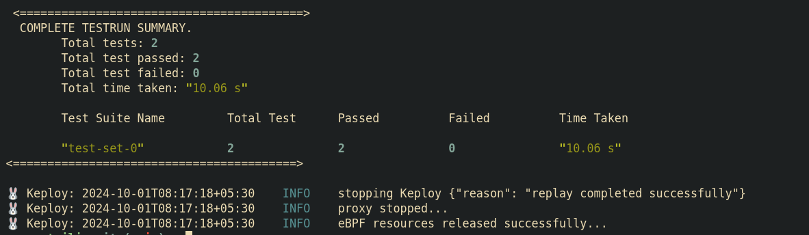

# Twilio Application
A sample application that sends an SMS using Twilio API.

## How to run
```
git clone https://github.com/keploy/samples-go.git && cd samples-go/go-twilio
go mod download

```

## Installing Keploy

```
curl -O https://raw.githubusercontent.com/keploy/keploy/main/keploy.sh && source keploy.sh
```

## Get Your twilio
- Sign in to the Twilio Console.
- Navigate to your Twilio project dashboard.
- Locate and copy your Account SID and Auth Token from the console.
- Obtain a Twilio Phone Number.
- Open your .env file in your project.
- Add the following environment variables to the .env file:
    - `TWILIO_ACCOUNT_SID`=your_account_sid
    - `TWILIO_AUTH_TOKEN`=your_auth_token
    - `TWILIO_NUMBER`=your_twilio_phone_number
- Save the `.env` file.

### Build the application
```
go build .
```

## Capture the Testcases
```
sudo -E keploy record -c "./go-twilio"
```
To generate test suites with Keploy, you can use tools like Hoppscotch, Postman, or cURL to send API requests. Keploy will capture these API calls and create comprehensive test suites, including detailed test cases and data mocks, allowing for easier testing and validation of your application.

## Make the POST requests
- Run the following command to make the POST requests:
```
curl --location 'http://127.0.0.1:8080/send-sms/' \
     --header 'Content-Type: application/json' \
     --data-raw '{
         "Body": "Keploy is awesome!",
         "To": "<YOUR_REGISTERED_PERSONAL_PHONE_NUMBER>"
     }'
```
Replace `<YOUR_REGISTERED_PERSONAL_PHONE_NUMBER>` with your registered personal phone number.

- Replace the placeholder `<SOME_WRONG_PHONE_NUMBER>` with an invalid phone number of your choice.
```
curl --location 'http://127.0.0.1:8080/send-sms/' \
     --header 'Content-Type: application/json' \
     --data-raw '{
         "Body": "Keploy is awesome!",
         "To": "<SOME_WRONG_PHONE_NUMBER>"
     }'
```
Both API calls have now been captured as test cases and should be visible within the Keploy CLI. You should see an app directory labeled `keploy` containing the test cases that were just recorded, along with the corresponding data mocks that were generated.


## Run the Testcases
Now, let’s execute the application in test mode.
```
sudo -E keploy test -c "./go-twilio" --delay 10
```
Our Testcases has passed and we can see the results in the CLI.



     