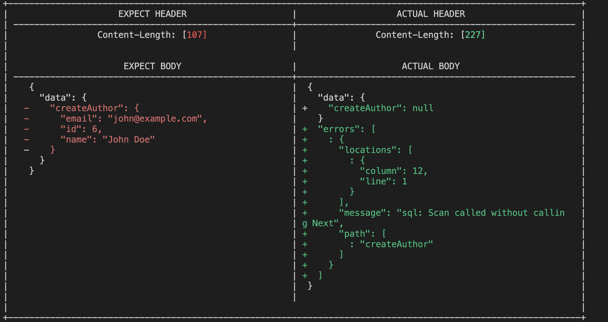

# Blog Post App

A sample  app to test Keploy integration capabilities using [Go Chi](https://go-chi.io/), [GraphQL](https://graphql.org/) and PostgreSQL. 

## Installation Setup

```bash
git clone https://github.com/keploy/samples-go.git && cd samples-go/graphql-sql
go mod download
```

## Installation Keploy


### Start Postgres Instance 

Using the docker-compose file we will start our postgres instance:-

```bash
# Start Postgres
docker-compose up -d
```

### Update the Host

> **Since we have setup our sample-app natively, we need to set the Postgres host on line 18, in `main.go` to `localhost`.**

### Capture the testcases

Now, we will create the binary of our application:-

```zsh
go build -cover
```

Once we have our binary file ready,this command will start the recording of API calls using ebpf:-

```shell
sudo -E keploy record -c "./keploy-gql"
```

Make API Calls using Hoppscotch, Postman or cURL command. Keploy with capture those calls to generate the test-suites containing testcases and data mocks.


#### Generate testcases

To generate testcases we just need to make some API calls. You can use [Postman](https://www.postman.com/), [Hoppscotch](https://hoppscotch.io/), or simply `curl`

#### Create Author

```bash
curl -X POST \
  -H "Content-Type: application/json" \
  -d '{"query": "mutation { createAuthor(name: \"John Doe\", email: \"john@example.com\") { id name email } }"}' \             
  http://localhost:8080/graphql
```

this will return the response: - 
```json
{
    "data": {
        "createAuthor": {
            "created_at": "2023-09-21 05:28:10.873001673 +0000 UTC m=+9.250422297",
            "email": "abc@xyz.com",
            "id": 0,
            "name": "Abc xyz"
        }
    }
}
```

#### Get Author

```bash
curl -X POST \
  -H "Content-Type: application/json" \
  -d '{"query": "{ authors { id name email } }"}' \
  http://localhost:8080/graphql
```

#### Create Posts

```bash
curl -X POST \
  -H "Content-Type: application/json" \
  -d '{"query": "mutation { createPost(title: \"My First Post\", content: \"This is the content\", author_id: 1) { id title content author { name } } }"}' \
  http://localhost:8080/graphql
```

#### Get Posts

```bash
curl -X POST \       
  -H "Content-Type: application/json" \
  -d '{"query": "{ posts { id title content author { name } } }"}' \ 
  http://localhost:8080/graphql
```

Now all these API calls were captured as **editable** testcases and written to `keploy/tests` folder. The keploy directory would also have `mocks` file that contains all the outputs of postgres operations. Here's what the folder structure look like:


Now, let's see the magic! ✨💫

## Run the Testcases

Now let's run the test mode (in the graphql-sql directory):

```shell
sudo -E keploy test -c "./keploy-gql" --goCoverage --delay 10
```

we can notice that our first testcase failed due to database configration


Output should look like:- 


With couple of API calls, we got upto 12.4% of code coverage. 🥳
