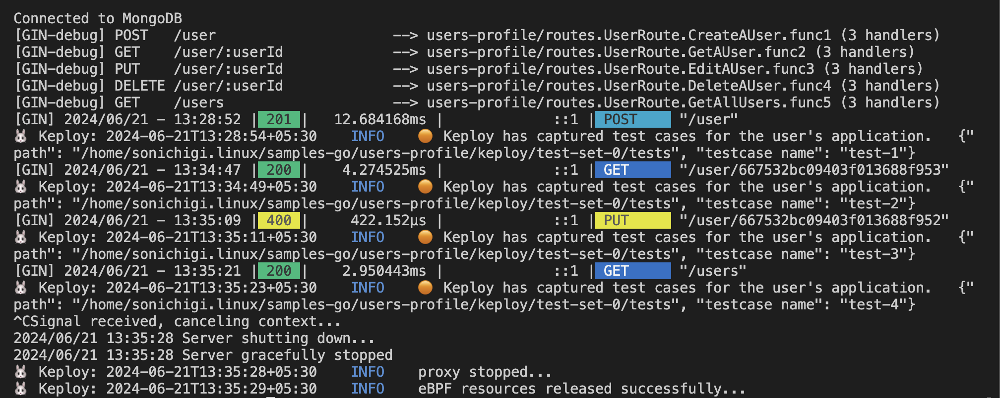
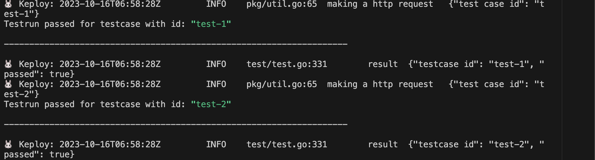

# Users-Profile

A sample application that get, create, update, and delete the data of a user in the database (MongoDB for this application).

## Prerequisites
1. [Go](https://go.dev/doc/install) 1.16 or later
2. [Docker](https://docs.docker.com/engine/install/) for running Keploy server
3. [Thunder Client](https://marketplace.visualstudio.com/items?itemName=rangav.vscode-thunder-client) / [Postman Desktop Agent](https://www.postman.com/downloads/postman-agent/) for testing localhost APIs
4. Code Editor ([VSCode](https://code.visualstudio.com/download), [Sublime Text](https://www.sublimetext.com/download), etc.)

## Start Users-Profile sample application
```
git clone https://github.com/keploy/samples-go && cd users-profile

go mod download
```

## Installation

There are two methods to run the sample application using Keploy :-

1. [Using Docker](#running-app-using-docker)
2. [Natively on Ubuntu/Windows(using WSL)](#run-app-natively-on-local-machine)

## Running app using Docker

Keploy can be used on Linux & Windows through [Docker](https://docs.docker.com/engine/install/), and on MacOS by the help of [Colima](https://docs.keploy/io/server/macos/installation)


### Create Keploy Alias

We need create an alias for Keploy:
```bash
alias keploy='sudo docker run --pull always --name keploy-v2 -p 16789:16789 --privileged --pid=host -it -v "$(pwd)":/files -v /sys/fs/cgroup:/sys/fs/cgroup -v /sys/kernel/debug:/sys/kernel/debug -v /sys/fs/bpf:/sys/fs/bpf -v /var/run/docker.sock:/var/run/docker.sock --rm ghcr.io/keploy/keploy'
```

### Let's start the MongoDB Instance
Using the docker-compose file we will start our mongodb instance:-
```bash
sudo docker run -p 27017:27017 -d --network keploy-network --name mongoDb mongo
```

Now, we will create the docker image of our application:-


```bash
docker build -t user-profile:1.0 .
```

### Capture the Testcases

```shell
keploy record -c "docker-compose up" --containerName "userProfileApp"
```

To genereate testcases we just need to make some API calls. You can use [Postman](https://www.postman.com/), [Hoppscotch](https://hoppscotch.io/), or simply `curl`


#### Routes
- `/user` : POST - Create a new user in the database
- `/user/:userId` : GET - Get a user from the database
- `/user/:userId` : PUT - Edit an existing user in the database
- `/user/:userId` : DELETE - Delete an existing user from the database
- `/users` : GET - Get all users from the database


here you can use this object template below for testing:
```shell
#you can copy paste this object template:

curl -X POST -H "Content-Type: application/json" -d '{
  "username": "Sonichigo",
  "name": "Animesh Pathak",
  "nationality": "Indian",
  "title": "Developer Advocate at Keploy",
  "hobbies": "Drumming",
  "linkedin": "@sonichigo",
  "twitter": "@sonichigo1219"
}' "http://localhost:8080/user"
```

**Post Request**


**GET Request**


Once done, you can see the Test Cases on the Keploy server, like this:



### Generate Test Runs

Now that we have our testcase captured, run the test file.

```shell
keploy test -c "docker-compose up" --containerName "userProfileApp" --delay 10
```

Once done, you can see the Test Runs on the Keploy server, like this:



### If you like the sample application, Don't forget to star us ✨
