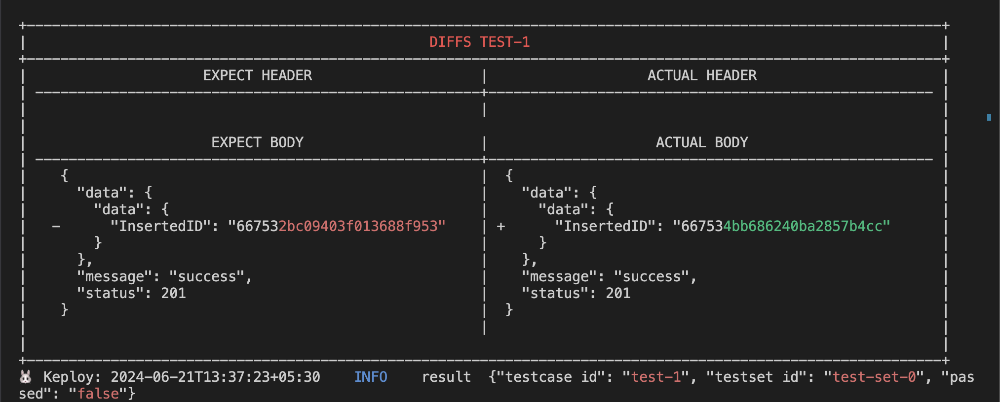
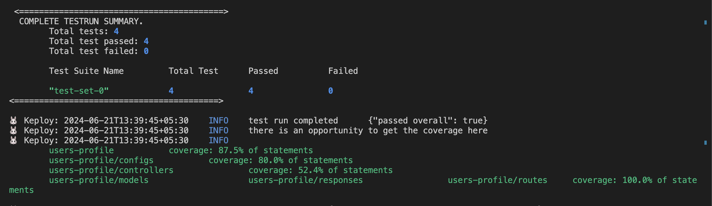

# Users-Profile

A sample application that get, create, update, and delete the data of a user in the database (MongoDB for this application).

## Prerequisites
1. [Go](https://go.dev/doc/install) 1.16 or later
2. [Docker](https://docs.docker.com/engine/install/) for running Keploy server
3. [Thunder Client](https://marketplace.visualstudio.com/items?itemName=rangav.vscode-thunder-client) / [Postman Desktop Agent](https://www.postman.com/downloads/postman-agent/) for testing localhost APIs
4. Code Editor ([VSCode](https://code.visualstudio.com/download), [Sublime Text](https://www.sublimetext.com/download), etc.)

## Start Users-Profile sample application
```
git clone https://github.com/keploy/samples-go && cd users-profile

go mod download
```

## Installation

```bash
curl --silent -O -L https://keploy.io/install.sh && source install.sh
```

Keploy can be used on Linux, Windows and MacOS through [Docker](https://docs.docker.com/engine/install/).

Note: To run Keploy on MacOS through [Docker](https://docs.docker.com/desktop/release-notes/#4252) the version must be ```4.25.2``` or above.

### Let's start the MongoDB Instance
Using the docker-compose file we will start our mongodb instance:-
```bash
sudo docker-compose up -d mongo
```

Now, we will create the docker image of our application:-


```bash
go build -cover
```

### Capture the Testcases

```shell
keploy record -c "./app"
```

To generate testcases we just need to make some API calls. You can use [Postman](https://www.postman.com/), [Hoppscotch](https://hoppscotch.io/), or simply `curl`


#### Routes
- `/user` : POST - Create a new user in the database
- `/user/:userId` : GET - Get a user from the database
- `/user/:userId` : PUT - Edit an existing user in the database
- `/user/:userId` : DELETE - Delete an existing user from the database
- `/users` : GET - Get all users from the database


**Post Request**

here you can use this object template below for testing:
```shell
#you can copy paste this object template:

curl -X POST -H "Content-Type: application/json" -d '{
  "username": "Sonichigo",
  "name": "Animesh Pathak",
  "nationality": "Indian",
  "title": "Developer Advocate at Keploy",
  "hobbies": "Drumming",
  "linkedin": "@sonichigo",
  "twitter": "@sonichigo1219"
}' "http://localhost:8080/user"
```


**GET Request**


Once done, you can see the Test Cases on the Keploy server, like this:


### Generate Test Runs

Now that we have our testcase captured, run the test file.

```shell
keploy test -c "./app" --goCoverage --delay 10
```

Once done, we can see that there is a noise present in our testcase:



**Let's add `body.data.InsertedID: []` under noise in `test-1.yaml` on line 43**
Now let's run the test mode once again: - 



_Voila! Our testcases have passed🥳_ . We can also notice that by capturing just few API calls we got around 87.5% of aggregated coverage with keploy generated testcases

If you like the sample application, Don't forget to star us ✨
